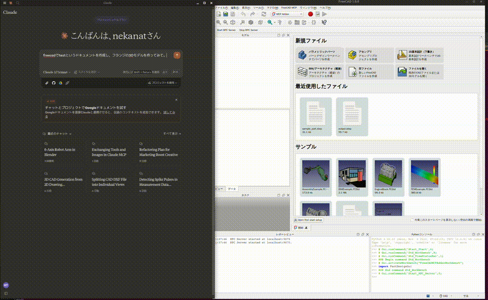
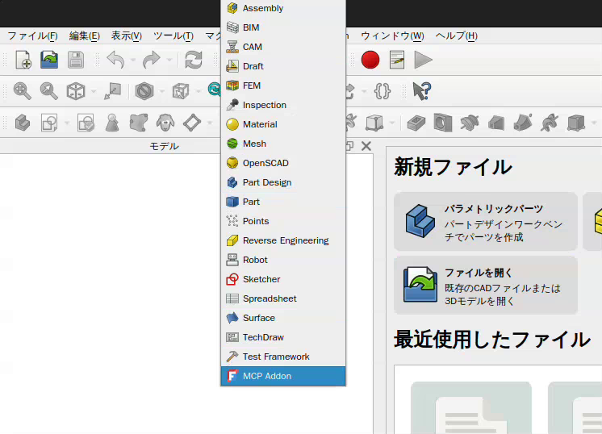
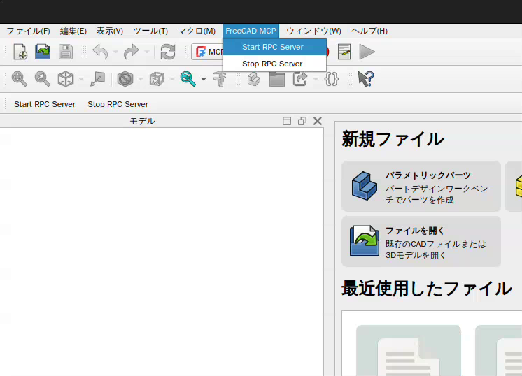

# FreeCAD MCP

This repository is a FreeCAD MCP that allows you to control FreeCAD from Claude Desktop.

## Demo



## Install addon

FreeCAD Addon directory is
* Windows: `%APPDATA%\FreeCAD\Mod\`
* Mac: `~/Library/Application Support/FreeCAD/Mod/`
* Linux: `~/.FreeCAD/Mod/` or `~/snap/freecad/common/Mod/` (if you install FreeCAD from snap)

Please put `addon/FreeCADMCP` directory to the addon directory.

When you install addon, you need to restart FreeCAD.
You can select "MCP Addon" from Workbench list and use it.



And you can start RPC server by "Start RPC Server" command in "FreeCAD MCP" toolbar.



## Setting up Claude Desktop

Edit `claude_desktop_config.json` file.

For user.

```json
{
  "mcpServers": {
    "freecad": {
      "command": "uvx",
      "args": [
        "freecad-mcp"
      ]
    }
  }
}
```

For developer.
First, you need clone this repository.

```bash
git clone https://github.com/neka-nat/freecad-mcp.git
```

```json
{
  "mcpServers": {
    "freecad": {
      "command": "uv",
      "args": [
        "--directory",
        "/path/to/freecad-mcp/",
        "run",
        "freecad-mcp"
      ]
    }
  }
}
```

## Tools

* `create_document`: Create a new document in FreeCAD.
* `create_object`: Create a new object in FreeCAD.
* `edit_object`: Edit an object in FreeCAD.
* `execute_code`: Execute arbitrary Python code in FreeCAD.
* `get_objects`: Get all objects in a document.
* `get_object`: Get an object in a document.
